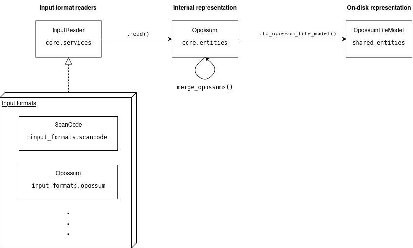

<!--
SPDX-FileCopyrightText: TNG Technology Consulting GmbH <https://www.tngtech.com>

SPDX-License-Identifier: Apache-2.0
-->

# Architecture of `opossum-file`

`opossum-file` generally consists of 3 parts:

1. The readers for the different input formats
1. An internal representation of an `.opossum` file, used for all operations on opossum files such as merging
1. A representation of an `.opossum` file as it is saved on disk, used for writing
   The following sections go into detail about each of these parts.
   

## Reading input formats

`opossum-file` supports multiple file formats as inputs. The data is converted into the internal opossum data representation, i.e. an instance of `Opossum`, before further operations occur. This reading and conversion step is described by the interface given by `InputReader`. The interface consists of a single method `read() -> Opossum`. The filepath is set via the constructor. So a complete invocation is e.g. `ScancodeFileReader(path).read()`.

### Adding a new input file reader

1. Make a new subfolder in `src/opossum_lib/input_formats/<format name>` for the format
1. Define your schema with `pydantic` (if applicable) in `<format name>/entities`
1. Implement the conversion from your new schema to `Opossum` (suggested file name `<format name>/services/convert_to_opossum.py`)
1. Don't forget to write some tests for it ;) The folder structure in `tests` mirrors the folder structure from `src`.
1. Create a subclass of `InputReader`. It will get a `pathlib.Path` in its constructur and is expected to implement an instance method `.read()` returning an instance of `Opossum`. Suggested file name `<format name>/services/<format name>_file_reader.py`
1. Hook it up to the CLI by creating a new CLI argument for it in `src/opossum_lib/cli.py` (use existing ones as blueprint)

## Internal representation of opossum files

All operations on opossum files (such as merging) is done using an internal representation of the data that is easier to work with than the representation used to save opossum data to disk.

The main difference between the schema of `.opossum` files and the internal representation are:

- the join map `resourcesToAttribution` is resolved by inlining the attributions from `externalAttributios` into the corresponding resources
- the folder structure given by `resources` is reflected by the resources directly containing their child resources

This datastructure guarantees that `resources`, `resourcesToAttribution` and `externalAttributions` are always consistent without having to update multiple places.

When working with resources, it is to note that the object referenced by the field `resources` of `ScanResults` (the pendant of an `.opossum`'s `input.jso`) is an instance of `RootResource` (see [`root_resource.py`](src/opossum_lib/core/entities/root_resource.py)). This class manages the buisness logic of adding additional `Resource`s via its `add_resource` method.

## On-disk Opossum format

We again use `pydantic` to specify the schema of the actual `.opossum` file. The definition lives in `src/opossum_lib/shared/entities` because it is used for both writing and reading `.opossum` files. However the code for the conversion between the internal `Opossum` and `OpossumFileModel` can be found in `src/opossum_lib/input_formats/opossum/services` following the same structure as the other input file formats. Writing an instance of `OpossumFileModel` to file can be done with `write_opossum_file` from `src/opossum_lib/core/services/write_opossum_file.py`.
